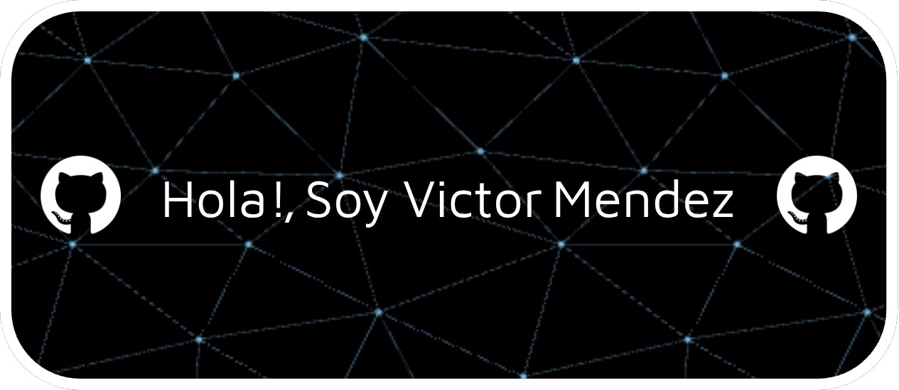

  

---

## 🎯 Sobre mí  
Soy **Tecnico y Programador junior** con habilidades en programacion, robotica, análisis de sistemas y análisis de datos.  
Tengo experiencia en proyectos académicos utilizando tecnologías como **Java**, **python**, **Spring Boot**, **MySQL**, **PostgreSQL** entre otros.  

Mi pasión se centra en el desarrollo de soluciones prácticas y efectivas.  
Estoy comprometido con el **aprendizaje continuo** y la **aplicación práctica** de mis conocimientos.  

---

## 💻 Habilidades Técnicas  

### Lenguajes de Programación  
-  **Java**  
-  **JavaScript**  
-  **Python**  
-  **C++**  

### Frameworks y Tecnologías  
-  **Spring Boot**  
-  **Angular**  

### Bases de Datos  
-  **PostgreSQL**  
-  **MySQL**  
-  **DB2**  
-  **Oracle**  

### Herramientas
-  **Obsidian**  
---

## 🌍 Idiomas  
| Idioma    | 
|-----------|
| Español   |
| Inglés    |

---

## 🌟 Características personales  
🔹 **Desarrollo profesional continuo**: Siempre en busca de nuevos retos y aprendizajes.  
🔹 **Trabajo en equipo**: Fomentando la colaboración para lograr objetivos comunes.  
🔹 **Liderazgo**: Capacidad para guiar y motivar a los demás.  
🔹 **Integridad**: Valores sólidos en cada proyecto.  
🔹 **Manejo del tiempo**: Organizado y eficiente.  

---

## 🎮 Pasatiempos  
🎯 **Lectura**: Amo explorar nuevos mundos e ideas a través de los libros.  
👨‍💻 **Programación**: Desarrollo de proyectos personales que me desafían y enseñan.  
🎮 **Videojuegos**: Pasión por los mundos virtuales y su diseño.  

---

---

---

> "La programación no es solo un trabajo, es una forma de dar vida a las ideas."
