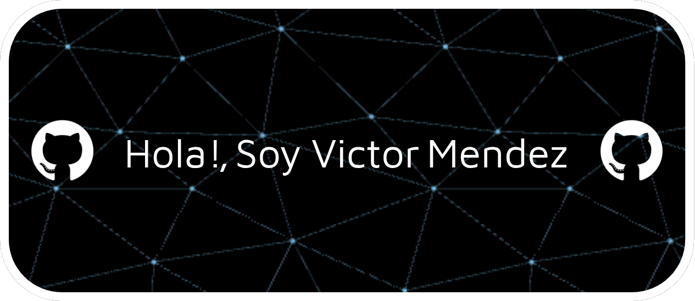

# Hola, soy Víctor Méndez 👋

**Técnico y programador** · Guatemala 🇬🇹

---

## 🎯 Sobre mí

Soy **técnico y programador junior** con habilidades en programación, robótica,
análisis de sistemas y análisis de datos. Tengo experiencia en proyectos
académicos con **Java**, **Python**, **PHP**, **Spring Boot**, **MySQL** y
**PostgreSQL**, entre otras tecnologías.

- 🔭 Estoy terminando mi **proyecto de graduación** en la Universidad Mariano Gálvez
- 🌱 Aprendiendo visión por computadora e IoT con Raspberry Pi
- 🎯 Objetivo: convertir mi pasión por la tecnología en soluciones que
  impacten positivamente en el mundo

---

## 🚀 Proyecto destacado

### 👁️ Asistente inteligente para personas con discapacidad visual

Proyecto de graduación (PG2): un prototipo con **Raspberry Pi 4 y cámara** que
detecta objetos en tiempo real con **YOLOv8n** y los anuncia por voz en español,
administrado desde un **panel web** propio.

- Detección en tiempo real con YOLOv8n optimizado con NCNN para ARM
- Panel administrativo en PHP (MVC propio) + MySQL: dispositivos, cámara en vivo,
  reportes en PDF y Excel, bitácora y configuración remota de cada prototipo
- Control a distancia de audífonos Bluetooth y red Wi-Fi del prototipo

---

## 🛠️ Tecnologías

**Lenguajes**

**Frameworks y librerías**

**Bases de datos**

**Herramientas**

---

## 📊 Estadísticas

---

## 🌟 Sobre cómo trabajo

| | |
|---|---|
| 📚 **Aprendizaje continuo** | Siempre en busca de nuevos retos |
| 🤝 **Trabajo en equipo** | Colaboración para lograr objetivos comunes |
| 🧭 **Liderazgo** | Capacidad para guiar y motivar a los demás |
| ⚖️ **Integridad** | Valores sólidos en cada proyecto |
| ⏱️ **Manejo del tiempo** | Organizado y eficiente |

**🌍 Idiomas:** Español (nativo) · Inglés

**🎮 Fuera del código:** lectura, videojuegos y proyectos personales que unen
creatividad con funcionalidad.

---

> *"La programación no es solo un trabajo, es una forma de dar vida a las ideas."*

